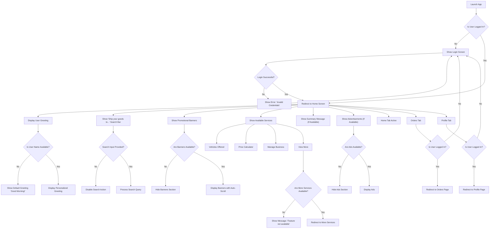

```mermaid
graph TD;
    %% Home Screen Navigation
    A[Launch App] --> B{Is User Logged In?}
    B -- No --> C[Show Login Screen] --> D{"Login Successful?"}
    D -- No --> E[Show Error: 'Invalid Credentials'] --> C
    D -- Yes --> F[Redirect to Home Screen]
    B -- Yes --> F[Redirect to Home Screen]

    %% Home Screen Elements
    F --> G["Display User Greeting"]
    F --> H["Show 'Ship your goods to...' Search Bar"]
    F --> I["Show Promotional Banners"]
    F --> J["Show Available Services"]
    F --> K["Show Summary Message (If Available)"]
    F --> L["Show Advertisements (If Available)"]

    %% Services Navigation
    J --> J1["Vehicles Offered"]
    J --> J2["Price Calculator"]
    J --> J3["Manage Business"]
    J --> J4["View More"]

    %% Edge Cases and Validations
    G --> V1{"Is User Name Available?"}
    V1 -- No --> E1["Show Default Greeting 'Good Morning!'"]
    V1 -- Yes --> G1["Display Personalized Greeting"]

    H --> V2{"Search Input Provided?"}
    V2 -- No --> E2["Disable Search Action"]
    V2 -- Yes --> H1["Process Search Query"]

    I --> V3{"Are Banners Available?"}
    V3 -- No --> E3["Hide Banners Section"]
    V3 -- Yes --> I1["Display Banners with Auto-Scroll"]

    J4 --> V4{"Are More Services Available?"}
    V4 -- No --> E4["Show Message: 'Feature not available'"]
    V4 -- Yes --> J5["Redirect to More Services"]

    L --> V5{"Are Ads Available?"}
    V5 -- No --> E5["Hide Ads Section"]
    V5 -- Yes --> L1["Display Ads"]

    %% Bottom Navigation
    F --> M["Home Tab Active"]
    F --> N["Orders Tab"]
    F --> O["Profile Tab"]

    N --> V6{"Is User Logged In?"}
    V6 -- No --> C
    V6 -- Yes --> N1["Redirect to Orders Page"]

    O --> V7{"Is User Logged In?"}
    V7 -- No --> C
    V7 -- Yes --> O1["Redirect to Profile Page"]
```
