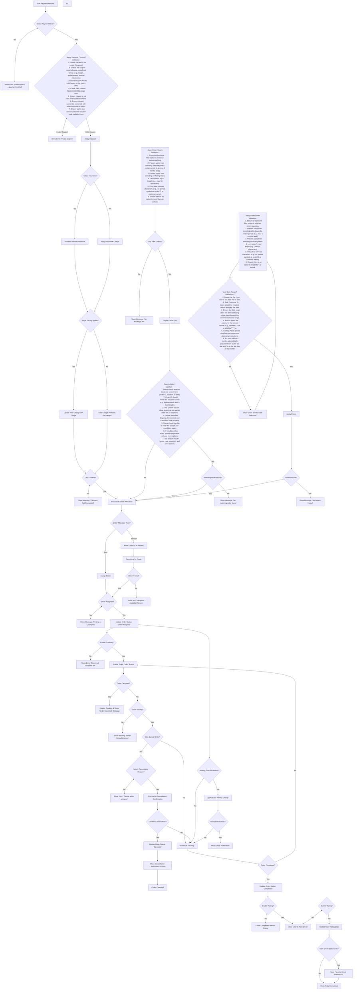

```mermaid
flowchart TD
    P1["Start Payment Process"] --> P2{"Select Payment Mode?"}
    P2 <-- No --> V1@{ label: "Show Error: 'Please select a payment method'" }
    P2 -- Yes --> P3{"Apply Discount Coupon?
Validation -
    1. Ensure the field is not empty if required.
    2. Ensure the coupon code follows a predefined format (e.g., length, alphanumeric, special characters).
    3. Ensure coupon should valid based on the expiry date.
    4. Check if the coupon has exceeded its usage limit.
    5. Ensure coupon is not valid for the selected items.
    6. Ensure coupon cannot be combined with other discounts or offers.
    7. Ensure same user cannot use same coupon code multiple times."}
    P3 <-- Invalid Coupon --> V2@{ label: "Show Error: 'Invalid coupon'" }
    P3 -- Valid Coupon --> P4["Apply Discount"]
    P4 --> P5{"Select Insurance?"}
    P5 -- No --> P6["Proceed without Insurance"]
    P5 -- Yes --> P7["Apply Insurance Charge"]
    P6 --> P8{"Surge Pricing Applied?"}
    P7 --> P8
    P8 -- Yes --> P9["Update Total Charge with Surge"]
    P8 -- No --> P10["Total Charge Remains Unchanged"]
    P9 --> P11{"Click Confirm?"}
    P10 --> P11
    P11 <-- No --> V3@{ label: "Show Warning: 'Payment Not Completed'" }
    P11 -- Yes --> O1["Proceed to Order Allocation"]
    H1["Open Order History
Validation -
    1. Ensure at least one filter option is selected before applying.
    2. Prevent users from selecting dates beyond a certain period (e.g., max 6 months back).
    3. Prevent users from selecting conflicting filters.
    4. Limit search input length (e.g., max 50 characters).
    5. Only allow relevant characters (e.g., no special symbols in order ID or customer name).
    6. Ensure there is an option to reset filters to default."] --> H2{"Any Past Orders?"}
    H2 -- No --> V7@{ label: "Show Message: 'No Bookings Yet'" }
    H2 -- Yes --> H3["Display Order List"]
    H3 --> H4{"Search Order?
Validtion - 
    1. Users should enter at least one search term (order ID, location, or date).
    2. Order ID should match the required format (e.g., alphanumeric with a fixed length).
    3. The system should allow searching with partial order IDs or locations.
    4.Ensure filters like Ongoing, Completed, and Cancelled work properly.
    5. Users should be able to clear the search and reset filters easily.
    6. If results are too many, provide pagination or Load More options.
    7. The search should ignore case sensitivity and extra spaces."}
    H4 -- No --> O1
    H4 -- Yes --> H5{"Matching Order Found?"}
    H5 -- No --> V8@{ label: "Show Message: 'No matching order found'" }
    H5 -- Yes --> O1
    F1["Apply Order Filters
Validation -
    1. Ensure at least one filter option is selected before applying.
    2. Prevent users from selecting dates beyond a certain period (e.g., max 6 months back).
    3. Prevent users from selecting conflicting filters.
    4. Limit search input length (e.g., max 50 characters).
    5. Only allow relevant characters (e.g., no special symbols in order ID or customer name).
    6. Ensure there is an option to reset filters to default."] --> F2{"Valid Date Range?
 Validations - 
    1. Ensure that the From date is not after the To date.
    2. Both From and To dates should be required before applying the filter.
    3. Ensure the date range does not allow selecting future dates beyond the current or allowed range.
    4. Ensure dates are entered in the correct format (e.g., DD/MM/YYYY or MM/DD/YYYY).
    5. Clicking Reset should clear both the month and date range selections.
    6. If a user selects a month, automatically populate From as the 1st day and To as the last day of that month."}
    F2 -- No --> V9@{ label: "Show Error: 'Invalid Date Selection'" }
    V9 --> F1
    F2 -- Yes --> F3["Apply Filters"]
    F3 --> F4{"Orders Found?"}
    F4 -- No --> V10@{ label: "Show Message: 'No Orders Found'" }
    F4 -- Yes --> O1
    O1 --> O2{"Order Allocation Type?"}
    O2 -- Manual --> O3@{ label: "Move Order to 'In Review'" }
    O2 -- Auto --> O4["Assign Driver"]
    O4 --> D1{"Driver Assigned?"}
    D1 <-- No --> V4@{ label: "Show Message: 'Finding a Champion'" }
    D1 -- Yes --> D2@{ label: "Update Order Status: 'Driver Assigned'" }
    D2 --> T1{"Enable Tracking?"} & W1{"Waiting Time Exceeded?"}
    T1 -- No --> V5@{ label: "Show Error: 'Driver not assigned yet'" }
    T1 -- Yes --> T2@{ label: "Enable 'Track Order' Button" }
    T2 --> T3{"Order Canceled?"}
    T3 -- Yes --> V11@{ label: "Disable Tracking & Show 'Order Canceled' Message" }
    T3 -- No --> T4{"Driver Moving?"}
    T4 -- No --> V12@{ label: "Show Warning: 'Driver Delay Detected'" }
    T4 -- Yes --> C1{"Click Cancel Order?"}
    C1 -- No --> O5["Continue Tracking"]
    C1 -- Yes --> C2{"Select Cancellation Reason?"}
    C2 <-- No --> V6@{ label: "Show Error: 'Please select a reason'" }
    C2 -- Yes --> C3["Proceed to Cancellation Confirmation"]
    C3 --> C4{"Confirm Cancel Order?"}
    C4 -- No --> O5
    C4 -- Yes --> C5@{ label: "Update Order Status: 'Canceled'" }
    C5 --> C6["Show Cancellation Confirmation Screen"]
    C6 --> End1["Order Canceled"]
    O3 --> S1["Searching for Driver"]
    S1 --> S2{"Driver Found?"}
    S2 -- No --> S3@{ label: "Show 'No Champions Available' Screen" }
    S2 -- Yes --> D1
    W1 -- No --> O5
    W1 -- Yes --> W2["Apply Extra Waiting Charge"]
    W2 --> W3{"Unexpected Delay?"}
    W3 -- No --> O5
    W3 -- Yes --> W4["Show Delay Notification"]
    O5 --> R1{"Order Completed?"}
    R1 -- No --> T2
    R1 -- Yes --> R2@{ label: "Update Order Status: 'Completed'" }
    R2 --> R3{"Enable Rating?"}
    R3 -- No --> End2["Order Completed Without Rating"]
    R3 -- Yes --> R4["Allow User to Rate Driver"]
    R5{"Submit Rating?"} <-- No --> R4
    R5 -- Yes --> R6["Update User Rating Data"]
    R6 --> R7{"Mark Driver as Favorite?"}
    R7 -- No --> End3["Order Fully Completed"]
    R7 -- Yes --> R8["Save Favorite Driver Preference"]
    R8 --> End3
    

    V1@{ shape: rect}
    V2@{ shape: rect}
    V3@{ shape: rect}
    V7@{ shape: rect}
    V8@{ shape: rect}
    V9@{ shape: rect}
    V10@{ shape: rect}
    O3@{ shape: rect}
    V4@{ shape: rect}
    D2@{ shape: rect}
    V5@{ shape: rect}
    T2@{ shape: rect}
    V11@{ shape: rect}
    V12@{ shape: rect}
    V6@{ shape: rect}
    C5@{ shape: rect}
    S3@{ shape: rect}
    R2@{ shape: rect}
    n1@{ shape: rect}


```
