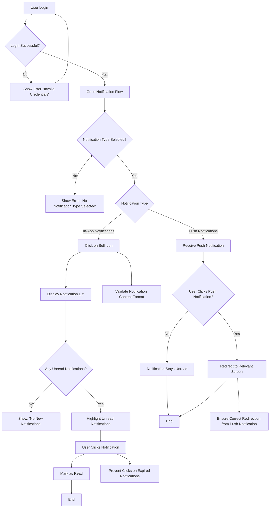

```mermaid
flowchart TD
    A["User Login"] --> B{"Login Successful?"}
    B -- No --> C@{ label: "Show Error: 'Invalid Credentials'" }
    C --> A
    B -- Yes --> D["Go to Notification Flow"]
    D --> E{"Notification Type Selected?"}
    E <-- No --> V1@{ label: "Show Error: 'No Notification Type Selected'" }
    E -- Yes --> F{"Notification Type"}
    F -- "In-App Notifications" --> G["Click on Bell Icon"]
    G --> H["Display Notification List"] & V2["Validate Notification Content Format"]
    H --> I{"Any Unread Notifications?"}
    I -- No --> J@{ label: "Show: 'No New Notifications'" }
    I -- Yes --> K["Highlight Unread Notifications"]
    K --> L["User Clicks Notification"]
    L --> M["Mark as Read"] & V3["Prevent Clicks on Expired Notifications"]
    M --> End1["End"]
    F -- Push Notifications --> N["Receive Push Notification"]
    N --> O{"User Clicks Push Notification?"}
    O -- No --> P["Notification Stays Unread"]
    P --> End2["End"]
    O -- Yes --> Q["Redirect to Relevant Screen"]
    Q --> End2 & V4["Ensure Correct Redirection from Push Notification"]

    C@{ shape: rect}
    V1@{ shape: rect}
    J@{ shape: rect}
```
