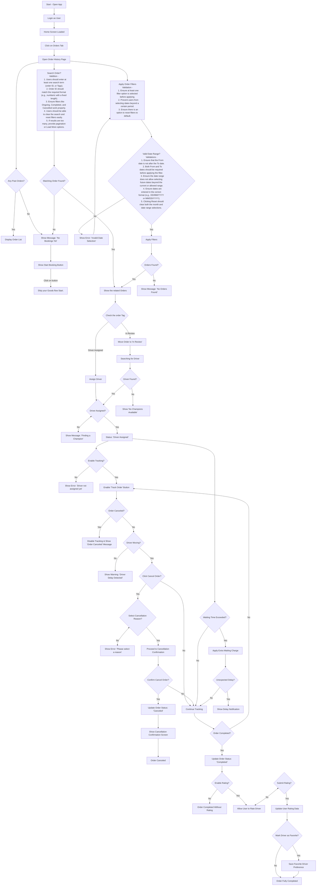

```mermaid
flowchart TD
    A["Start - Open App"] --> B["Login as User"]
    B --> C["Home Screen Loaded"]
    C --> D["Click on Orders Tab"]
    D --> H1["Open Order History Page"]
    H1 --> H2{"Any Past Orders?"} & H4["Search Order?
Validtion - 
    1. Users should enter at least one search term (order ID, or Tags).
    2. Order ID should match the required format (e.g., numberic with a fixed length).
    3. Ensure filters like Ongoing, Completed, and Cancelled work properly.
    4. Users should be able to clear the search and reset filters easily.
    5. If results are too many, provide pagination or Load More options."] & F1["Apply Order Filters
Validation -
    1. Ensure at least one filter option is selected before applying.
    2. Prevent users from selecting dates beyond a certain period.
    3. Ensure there is an option to reset filters to default."]
    H2 -- Yes --> H3["Display Order List"]
    H2 -- No --> V7@{ label: "Show Message: 'No Bookings Yet'" }
    V7 --> V1["Show Start Booking Button"]
    V1 -- Click on button --> V2["Ship your Goods flow Start."]
    H4 --> H5{"Matching Order Found?"}
    H5 -- No --> V7
    H5 -- Yes --> O1["Show the related Orders"]
    F1 --> F2{"Valid Date Range?
 Validations - 
    1. Ensure that the From date is not after the To date.
    2. Both From and To dates should be required before applying the filter.
    3. Ensure the date range does not allow selecting future dates beyond the current or allowed range.
    4. Ensure dates are entered in the correct format (e.g., DD/MM/YYYY or MM/DD/YYYY).
    5. Clicking Reset should clear both the month and date range selections."}
    F2 -- No --> V9@{ label: "Show Error: 'Invalid Date Selection'" }
    V9 --> F1
    F2 -- Yes --> F3["Apply Filters"]
    F3 --> F4{"Orders Found?"}
    F4 -- No --> V10@{ label: "Show Message: 'No Orders Found'" }
    F4 -- Yes --> O1
    O1 --> O2{"Check the order Tag"}
    O2 -- In Review --> O3@{ label: "Move Order to 'In Review'" }
    O2 -- Driver Assigned --> O4["Assign Driver"]
    O4 --> D1{"Driver Assigned?"}
    D1 <-- No --> V4@{ label: "Show Message: 'Finding a Champion'" }
    D1 -- Yes --> D2@{ label: " Status: 'Driver Assigned'" }
    D2 --> T1{"Enable Tracking?"} & W1{"Waiting Time Exceeded?"}
    T1 -- No --> V5@{ label: "Show Error: 'Driver not assigned yet'" }
    T1 -- Yes --> T2@{ label: "Enable 'Track Order' Button" }
    T2 --> T3{"Order Canceled?"}
    T3 -- Yes --> V11@{ label: "Disable Tracking & Show 'Order Canceled' Message" }
    T3 -- No --> T4{"Driver Moving?"}
    T4 -- No --> V12@{ label: "Show Warning: 'Driver Delay Detected'" }
    T4 -- Yes --> C1{"Click Cancel Order?"}
    C1 -- No --> O5["Continue Tracking"]
    C1 -- Yes --> C2{"Select Cancellation Reason?"}
    C2 <-- No --> V6@{ label: "Show Error: 'Please select a reason'" }
    C2 -- Yes --> C3["Proceed to Cancellation Confirmation"]
    C3 --> C4{"Confirm Cancel Order?"}
    C4 -- No --> O5
    C4 -- Yes --> C5@{ label: "Update Order Status: 'Canceled'" }
    C5 --> C6["Show Cancellation Confirmation Screen"]
    C6 --> End1["Order Canceled"]
    O3 --> S1["Searching for Driver"]
    S1 --> S2{"Driver Found?"}
    S2 -- No --> S3@{ label: "Show 'No Champions Available'" }
    S2 -- Yes --> D1
    W1 -- No --> O5
    W1 -- Yes --> W2["Apply Extra Waiting Charge"]
    W2 --> W3{"Unexpected Delay?"}
    W3 -- No --> O5
    W3 -- Yes --> W4["Show Delay Notification"]
    O5 --> R1{"Order Completed?"}
    R1 -- No --> T2
    R1 -- Yes --> R2@{ label: "Update Order Status: 'Completed'" }
    R2 --> R3{"Enable Rating?"}
    R3 -- No --> End2["Order Completed Without Rating"]
    R3 -- Yes --> R4["Allow User to Rate Driver"]
    R5{"Submit Rating?"} <-- No --> R4
    R5 -- Yes --> R6["Update User Rating Data"]
    R6 --> R7{"Mark Driver as Favorite?"}
    R7 -- No --> End3["Order Fully Completed"]
    R7 -- Yes --> R8["Save Favorite Driver Preference"]
    R8 --> End3

    V7@{ shape: rect}
    V9@{ shape: rect}
    V10@{ shape: rect}
    O3@{ shape: rect}
    V4@{ shape: rect}
    D2@{ shape: rect}
    V5@{ shape: rect}
    T2@{ shape: rect}
    V11@{ shape: rect}
    V12@{ shape: rect}
    V6@{ shape: rect}
    C5@{ shape: rect}
    S3@{ shape: rect}
    R2@{ shape: rect}
```
