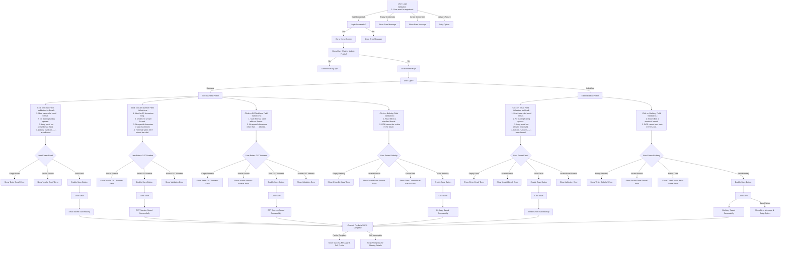

```mermaid

   graph TD;
    %% Login Flow
    A[User Login
    Validation -
    1. User must be registered.] -->|Valid Credentials| B[Login Successful?]
    B -->|Yes| C[Go to Home Screen]
    B -->|No| D[Show Error Message]
    
    C --> E[Does User Want to Update Profile?]
    E -->|No| F[Continue Using App]
    E -->|Yes| G[Go to Profile Page]
    
    G --> H[User Type?]
    H -->|Business| I[Edit Business Profile]
    H -->|Individual| J[Edit Individual Profile]

    %% Business Edit Flow
    I --> I1["Click on Email Field
    Validation for Email -
    1. Must have valid email format.
    2. No leading/trailing spaces.
    3. Long email not allowed (max 320).
    4. Letters, numbers, _, -, . are allowed."]
    I1 --> I2{"User Enters Email"}
    I2 -->|Empty Email| I3["Show 'Enter Email' Error"]
    I2 -->|Invalid Format| I4["Show 'Invalid Email' Error"]
    I2 -->|Valid Email| I5["Enable Save Button"]
    I5 --> I6["Click Save"]
    I6 --> I7["Email Saved Successfully"]

    I --> I8["Click on GST Number Field
    Validations - 
    1. Must be 15 characters long.
    2. Must be in proper format.
    3. No special characters or spaces allowed.
    4. The PAN within GST should be valid."]
    I8 --> I9{"User Enters GST Number"}
    I9 -->|Invalid Format| I10["Show 'Invalid GST Number' Error"]
    I9 -->|Valid GST Number| I11["Enable Save Button"]
    I11 --> I12["Click Save"]
    I12 --> I13["GST Number Saved Successfully"]

    I --> I14["Click on GST Address Field
    Validations - 
    1. Must follow a valid address format.
    2. No special characters other than , . - allowed."]
    I14 --> I15{"User Enters GST Address"}
    I15 -->|Empty Address| I16["Show 'Enter GST Address' Error"]
    I15 -->|Invalid Format| I17["Show 'Invalid Address Format' Error"]
    I15 -->|Valid GST Address| I18["Enable Save Button"]
    I18 --> I19["Click Save"]
    I19 --> I20["GST Address Saved Successfully"]

    I --> I21["Click on Birthday Field
    Validations -
    1. Must follow a standard format.
    2. DOB cannot be a date in the future."]
    I21 --> I22{"User Enters Birthday"}
    I22 -->|Empty Birthday| I23["Show 'Enter Birthday' Error"]
    I22 -->|Invalid Format| I24["Show 'Invalid Date Format' Error"]
    I22 -->|Future Date| I25["Show 'Date Cannot Be in Future' Error"]
    I22 -->|Valid Birthday| I26["Enable Save Button"]
    I26 --> I27["Click Save"]
    I27 --> I28["Birthday Saved Successfully"]

    %% Individual Edit Flow
    J --> J1["Click on Email Field
    Validation for Email -
    1. Must have valid email format.
    2. No leading/trailing spaces.
    3. Long email not allowed (max 320).
    4. Letters, numbers, _, -, . are allowed."]
    J1 --> J2{"User Enters Email"}
    J2 -->|Empty Email| J3["Show 'Enter Email' Error"]
    J2 -->|Invalid Format| J4["Show 'Invalid Email' Error"]
    J2 -->|Valid Email| J5["Enable Save Button"]
    J5 --> J6["Click Save"]
    J6 --> J7["Email Saved Successfully"]

    J --> J8["Click on Birthday Field
    Validations -
    1. Must follow a standard format.
    2. DOB cannot be a date in the future."]
    J8 --> J9{"User Enters Birthday"}
    J9 -->|Empty Birthday| J10["Show 'Enter Birthday' Error"]
    J9 -->|Invalid Format| J11["Show 'Invalid Date Format' Error"]
    J9 -->|Future Date| J12["Show 'Date Cannot Be in Future' Error"]
    J9 -->|Valid Birthday| J13["Enable Save Button"]
    J13 --> J14["Click Save"]
    J14 --> J15["Birthday Saved Successfully"]

    %% Profile Completion Check
    I7 --> L["Check if Profile is 100% Complete"]
    I13 --> L
    I20 --> L
    I28 --> L
    J7 --> L
    J15 --> L
    L -->|Profile Complete| M["Show Success Message & Full Profile"]
    L -->|Still Incomplete| N["Keep Prompting for Missing Details"]

    %% Edge Cases
    A -->|Empty Credentials| X1[Show Error Message]
    A -->|Invalid Credentials| X2[Show Error Message]
    A -->|Network Failure| X3[Retry Option]
    I9 -->|Invalid GST Number| X6[Show Validation Error]
    I15 -->|Invalid GST Address| X9[Show Validation Error]
    J2 -->|Invalid Email Format| X7[Show Validation Error]
    J14 -->|Save Failure| X8[Show Error Message & Retry Option]

```
